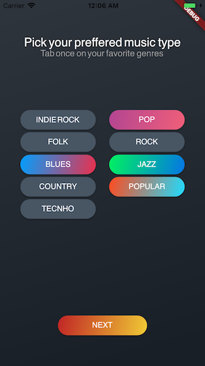
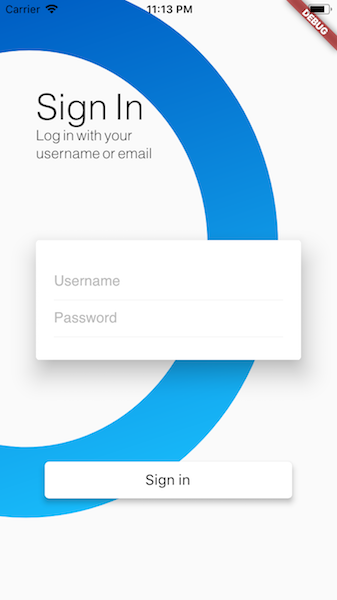
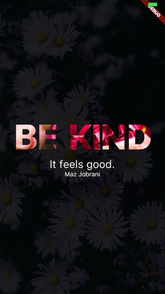

# Gradient Screens

A Flutter project to shows gradients demo.
It shows gradients applied to buttons, texts and backgrounds.

 

it uses [Gradient Widgets](https://github.com/bluemix/gradient-widgets) (you can try it 😀)

### Inspirations
* [Genres page](https://www.designspiration.net/save/5597545571572/)
* [Login page](https://www.tenniswood.co.uk/post/160767831482)

## Flutter: Getting Started

For help getting started with Flutter, view our online
[documentation](https://flutter.io/).
